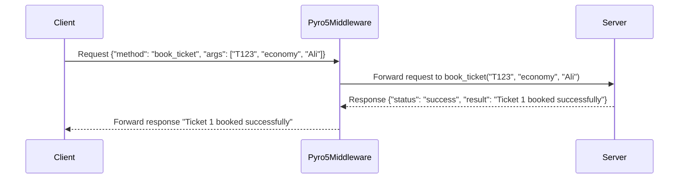

# **Phase 1: Train Ticket Booking System Using Pyro5**

This project demonstrates a Train Reservation System built using the Pyro5 library. The system allows clients to remotely add trains, book tickets, unbook tickets, and query ticket details through a Pyro5-based middleware.

---

## **Features**

1. **Train Management**:
   - Add new trains with details such as origin, destination, and departure time.

2. **Ticket Booking**:
   - Book tickets for specific trains with passenger details and seat preferences (economy or business class).

3. **Ticket Management**:
   - Unbook previously booked tickets by ticket ID.
   - Query all tickets for a specific train.
   - Query all tickets for trains departing on a specific date.

4. **Pyro5 Middleware**:
   - Uses Pyro5 for remote method invocation, enabling seamless client-server communication.

---

## **How It Works**

### **Server (`reservation_server.py`)**
- Implements the `ReservationServer` class, which is exposed to Pyro5 for remote method invocation.
- The server provides the following methods:
  - `add_train(train_id, origin, destination, departure)`:
    Adds a new train with its details.
  - `book_ticket(train_id, seat_type, passenger_name)`:
    Books a ticket for a specific train.
  - `unbook_ticket(train_id, ticket_id)`:
    Cancels a booked ticket by ticket ID.
  - `get_tickets_by_train_id(train_id)`:
    Retrieves all tickets for a specific train.
  - `get_tickets_by_date(date)`:
    Retrieves all tickets for trains departing on a specific date.

### **Client (`client.py`)**
- Connects to the server via the Pyro5 naming service.
- Provides an interactive CLI for the user to perform operations such as adding trains, booking tickets, and querying ticket details.

---

## **How to Run**

### **Prerequisites**
- Install Poetry:
  ```bash
  pip install poetry
  ```
- Install project dependency:
  ```bash
  poetry install
  ```

### **Steps**
1. **Start the Pyro5 Name Server**:
   Run the following command to start the Pyro5 naming service:
   ```bash
   python -m Pyro5.nameserver
   ```
   This service will listen for and resolve client requests.

2. **Start the Reservation Server**:
   Open another terminal and run:
   ```bash
   python reservation_server.py
   ```
   The server will register itself with the Pyro5 naming service and begin accepting client requests.

3. **Start the Client**:
   Open a new terminal and run:
   ```bash
   python client.py
   ```
   This will launch the interactive client.

---

## **Client CLI Example**

The client provides the following menu for interacting with the server:
```
--- Train Reservation System ---
1. Add Train
2. Book Ticket
3. Unbook Ticket
4. Get Tickets by Train ID
5. Get Tickets by Date
6. Exit
```

### Example Usage:
1. **Add a Train**:
   ```
   Train ID: T123
   Origin: CityA
   Destination: CityB
   Departure: 2024-12-01 10:00
   ```
   Server Response: `Train T123 added successfully.`

2. **Book a Ticket**:
   ```
   Train ID: T123
   Seat Type: economy
   Passenger Name: Ali
   ```
   Server Response: `Ticket 1 booked successfully for Ali in economy class.`

3. **Query Tickets by Train ID**:
   ```
   Train ID: T123
   ```
   Server Response:
   ```
   [
       {"ticket_id": 1, "seat_type": "economy", "passenger_name": "Ali"}
   ]
   ```

4. **Unbook a Ticket**:
   ```
   Train ID: T123
   Ticket ID: 1
   ```
   Server Response: `Ticket 1 successfully unbooked.`

---

## **Project Files**

1. **`reservation_server.py`**:
   - Contains the `ReservationServer` class, which handles train and ticket operations.
   - Uses Pyro5 for remote method invocation.

2. **`client.py`**:
   - Connects to the server via Pyro5's naming service.
   - Provides a CLI for interacting with the server.

3. **`howtorun.txt`**:
   - Contains the command to start the Pyro5 naming service.

---

## **Sequence Diagram**

Below is a sequence diagram illustrating how the `book_ticket` method is executed:



---

## **Conclusion**

The Train Reservation System demonstrates the use of Pyro5 for building a lightweight, distributed middleware. This system can be further extended with features like authentication, persistent storage, and advanced querying.
