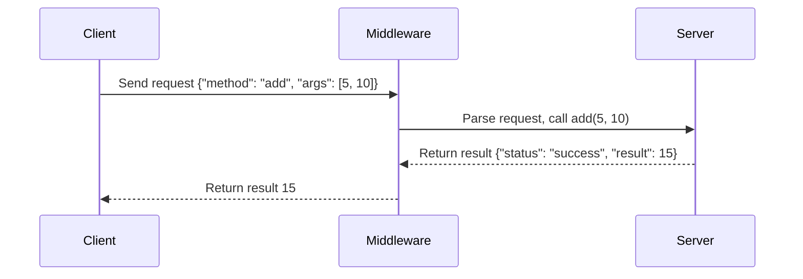

# **Primitive Type RMI Middleware**

This project demonstrates a Remote Method Invocation (RMI) middleware implemented in Python. The middleware enables a client to call methods on a remote server, passing arguments and receiving results over a network socket. It supports primitive data types and basic operations.

---

## **Project Files**

### 1. `server.py`
- Implements the **PrimitiveTypeServer**, which exposes the following methods:
  - **add(a, b)**: Adds two integers.
  - **multiply(a, b)**: Multiplies two floats.
  - **is_even(num)**: Checks if an integer is even.
  - **to_upper(text)**: Converts a string to uppercase.
  - **reverse_list(items)**: Reverses a list of items.
- Handles incoming client requests using a JSON-based protocol.

### 2. `client.py`
- Implements the **PrimitiveTypeClient**, which connects to the server to invoke the available methods.
- Provides a Command Line Interface (CLI) for users to interact with the server.

---

## **How to Run**

### Prerequisites
- Python 3.x installed.
- Ensure both `client.py` and `server.py` are in the same directory.

### Steps to Execute
1. **Start the Server**:
   Run the server script to initialize the `PrimitiveTypeServer`:
   ```bash
   python server.py
   ```
   The server will start on `localhost` at port `9090`.

2. **Run the Client**:
   Open a new terminal and run the client script:
   ```bash
   python client.py
   ```
   This will launch the CLI for interacting with the server.

3. **Interact via CLI**:
   Use the numbered menu to invoke server methods. Example:
   ```
   --- Primitive Type Operations ---
   1. Add Two Numbers
   2. Multiply Two Numbers
   3. Check if a Number is Even
   4. Convert Text to Uppercase
   5. Reverse a List
   6. Exit
   Enter your choice: 1
   Enter first number: 5
   Enter second number: 10
   Result: 15
   ```

---

## **Sequence Diagram**

Below is a sequence diagram illustrating the flow of a client calling the `add` method on the server:



---

## **Features**

1. **Dynamic Method Dispatch**:
   - The server dynamically resolves the method name and executes it based on the JSON request.

2. **Supported Methods**:
   - `add(a, b)`: Adds two integers.
   - `multiply(a, b)`: Multiplies two floats.
   - `is_even(num)`: Checks if an integer is even.
   - `to_upper(text)`: Converts text to uppercase.
   - `reverse_list(items)`: Reverses a list.

3. **Fault Tolerance**:
   - Handles invalid method calls and arguments gracefully, returning a JSON error response.

---

## **Error Handling**

The server responds with error messages if:
1. The requested method does not exist.
2. Incorrect arguments are passed to the method.

Example:
- Client sends a request for an unsupported method:
  ```json
  {"method": "non_existent", "args": []}
  ```
- Server responds:
  ```json
  {"status": "error", "message": "'PrimitiveTypeServer' object has no attribute 'non_existent'"}
  ```

---
