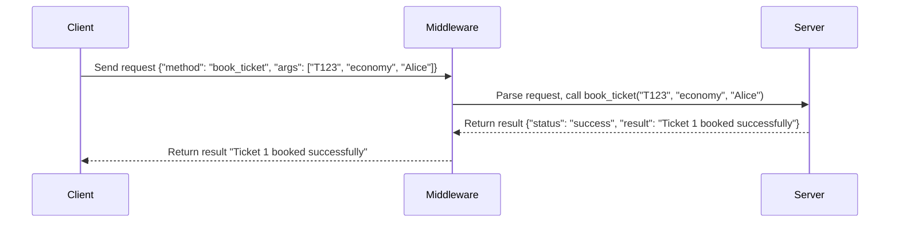

# **Train Reservation System using Custom RMI Middleware**

This project demonstrates a Train Reservation System built using a custom Remote Method Invocation (RMI) middleware. It enables clients to remotely add trains, book tickets, unbook tickets, and query ticket details via a network.

---

## **Project Files**

### 1. `server.py`
- Implements the **ReservationServer**, which provides the following methods:
  - **add_train(train_id, origin, destination, departure)**: Adds a new train with its details.
  - **book_ticket(train_id, seat_type, passenger_name)**: Books a ticket for a train.
  - **unbook_ticket(train_id, ticket_id)**: Cancels a booked ticket.
  - **get_tickets_by_train_id(train_id)**: Retrieves all tickets for a specific train.
  - **get_tickets_by_date(date)**: Retrieves tickets for trains departing on a given date.
- Listens for client requests over a socket and handles them dynamically.

### 2. `client.py`
- Implements the **ReservationClient**, which connects to the server and invokes the available methods remotely.
- Provides a Command Line Interface (CLI) for user interaction.

---

## **How It Works**

### **Workflow**
1. The client sends a JSON request to the server specifying the method name and arguments.
2. The server dynamically resolves the requested method and executes it.
3. The server responds with the result or an error message in JSON format.

---

## **How to Run**

### **Prerequisites**
- Python 3.x installed.
- Ensure both `client.py` and `server.py` are in the same directory.

### **Steps to Execute**
1. **Start the Server**:
   Run the server script to initialize the `ReservationServer`:
   ```bash
   python server.py
   ```
   The server will start on `localhost` at port `9090`.

2. **Run the Client**:
   Open a new terminal and run the client script:
   ```bash
   python client.py
   ```
   This will launch the CLI for interacting with the server.

3. **Example Commands**:
   - Add a Train:
     ```
     Train ID: T123
     Origin: CityA
     Destination: CityB
     Departure: 2024-12-01 10:00
     ```
   - Book a Ticket:
     ```
     Train ID: T123
     Seat Type: economy
     Passenger Name: Alice
     ```

---

## **Features**

1. **Dynamic Method Invocation**:
   - The server dynamically resolves method calls based on client requests.

2. **CRUD Operations**:
   - Add, book, unbook, and query tickets.

3. **Scalability**:
   - Can be extended to support additional operations and data types.

4. **Error Handling**:
   - Returns JSON responses with clear error messages for invalid requests.

---

## **Sequence Diagram**

Below is a sequence diagram illustrating the flow of a client booking a ticket:



---

## **Error Handling**

The server responds with error messages in the following scenarios:
1. **Method Not Found**:
   - Example:
     ```json
     {"method": "non_existent_method", "args": []}
     ```
     Response:
     ```json
     {"status": "error", "message": "'ReservationServer' object has no attribute 'non_existent_method'"}
     ```

2. **Invalid Arguments**:
   - Example:
     ```json
     {"method": "book_ticket", "args": ["T123"]}
     ```
     Response:
     ```json
     {"status": "error", "message": "book_ticket() missing 2 required positional arguments: 'seat_type' and 'passenger_name'"}
     ```

---

## **Client Interface**

The CLI provides an interactive menu to perform the following actions:
1. Add a train.
2. Book a ticket.
3. Unbook a ticket.
4. Query tickets by train ID.
5. Query tickets by date.
6. Exit the application.

Example interaction:
```
--- Train Reservation System ---
1. Add Train
2. Book Ticket
3. Unbook Ticket
4. Get Tickets by Train ID
5. Get Tickets by Date
6. Exit
Enter your choice: 2
Train ID: T123
Seat Type: economy
Passenger Name: Alice
Server Response: Ticket 1 booked successfully for Alice in economy class.
```

---

## **File Details**

### `server.py`
Contains the server logic for:
- Managing train and ticket data.
- Handling client requests dynamically.
- Sending JSON responses.

### `client.py`
Contains the client logic for:
- Connecting to the server.
- Sending requests and receiving responses.
- Providing a user-friendly CLI.

---

Let me know if you need additional information or assistance!
