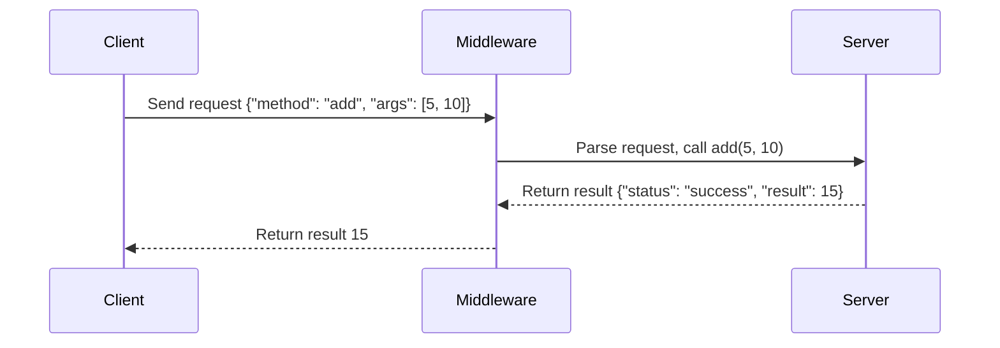
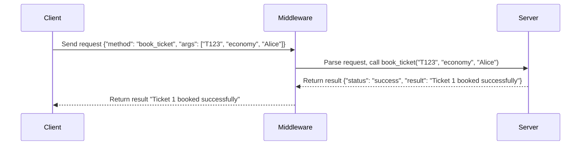

# RMI-distributed-systems
RMI Distributed Systems - Fall 2024 at CE AUT
# First Phase
## Train Ticket Reservation System with Pyro5

This project is a **distributed train ticket reservation system** implemented in Python using the **Pyro5 library** for Remote Method Invocation (RMI). It allows clients to interact with a remote server to manage train schedules and reservations seamlessly.

---

## Features

### Server-Side Features:
- **Add Trains**: Add new trains with details such as train ID, origin, destination, and departure time.
- **Book Tickets**: Reserve tickets for passengers, specifying the seat type (e.g., economy, business) and passenger name.
- **Unbook Tickets**: Cancel reservations using ticket IDs.
- **Query Tickets by Train ID**: Retrieve all tickets for a specific train.
- **Query Tickets by Date**: Retrieve all tickets for trains departing on a given date.

### Client-Side Features:
- A text-based menu for users to interact with the server to:
  - Add trains.
  - Book or unbook tickets.
  - Query tickets by train ID or departure date.

### RMI Features:
- **Remote Invocation**: The server methods are exposed remotely, allowing clients to invoke them as though they are local.
- **Concurrent Access**: Multiple clients can interact with the server simultaneously.

---

## Technologies Used
- **Python 3.10+**
- **Pyro5**: Simplifies remote method invocation by managing communication and object serialization.

---

## Installation and Setup

1. **Clone the Repository**:
   ```bash
   git clone https://github.com/aliraee/RMI-distributed-systems.git
   cd train-reservation-system


# **RMI Middleware Project - Phase 2**

This project demonstrates a Remote Method Invocation (RMI) middleware implemented in Python with two parts:
1. **Part 1: Supporting Primitive Data Types**
2. **Part 2: Supporting Train Ticket Booking Middleware**

---

## **Part 1: Supporting Primitive Data Types**

### **Overview**
This part of the project implements an RMI middleware that supports primitive data types such as integers, floats, strings, and lists. The middleware allows a client to invoke basic operations on a remote server over a network.

### **Features**
1. **Supported Methods**:
   - `add(a, b)`: Adds two integers.
   - `multiply(a, b)`: Multiplies two floats.
   - `is_even(num)`: Checks if an integer is even.
   - `to_upper(text)`: Converts a string to uppercase.
   - `reverse_list(items)`: Reverses a list of strings.

2. **Dynamic Method Dispatch**:
   - The server dynamically resolves method calls based on the client's JSON request.

3. **Error Handling**:
   - The server responds with error messages for invalid method calls or arguments.

### **File Details**
1. **`server.py`**:
   - Implements the `PrimitiveTypeServer` class.
   - Handles client requests and dynamically invokes methods.

2. **`client.py`**:
   - Implements the `PrimitiveTypeClient` class.
   - Provides a Command Line Interface (CLI) for invoking server methods.

### **How to Run**
1. Start the server:
   ```bash
   python server.py
   ```
2. Start the client:
   ```bash
   python client.py
   ```

3. Use the CLI to invoke methods:
   ```
   --- Primitive Type Operations ---
   1. Add Two Numbers
   2. Multiply Two Numbers
   3. Check if a Number is Even
   4. Convert Text to Uppercase
   5. Reverse a List
   6. Exit
   Enter your choice: 1
   Enter first number: 10
   Enter second number: 20
   Result: 30
   ```

---

## **Part 2: Supporting Train Ticket Booking Middleware**

### **Overview**
This part extends the RMI middleware to support a Train Ticket Booking System. It allows clients to remotely add trains, book tickets, unbook tickets, and query ticket details via the RMI middleware.

### **Features**
1. **Supported Methods**:
   - `add_train(train_id, origin, destination, departure)`: Adds a train with its details.
   - `book_ticket(train_id, seat_type, passenger_name)`: Books a ticket for a specific train.
   - `unbook_ticket(train_id, ticket_id)`: Cancels a ticket for a specific train.
   - `get_tickets_by_train_id(train_id)`: Retrieves all tickets for a given train.
   - `get_tickets_by_date(date)`: Retrieves all tickets for trains departing on a specific date.

2. **Dynamic Method Dispatch**:
   - The server dynamically resolves method calls based on the client's JSON request.

3. **Error Handling**:
   - The server responds with clear error messages for invalid operations.

### **File Details**
1. **`server.py`**:
   - Implements the `ReservationServer` class to manage train and ticket data.
   - Handles client requests dynamically and sends JSON responses.

2. **`client.py`**:
   - Implements the `ReservationClient` class to interact with the server.
   - Provides a user-friendly CLI for ticket booking and querying.

### **How to Run**
1. Start the server:
   ```bash
   python server.py
   ```
2. Start the client:
   ```bash
   python client.py
   ```

3. Use the CLI for operations:
   ```
   --- Train Reservation System ---
   1. Add Train
   2. Book Ticket
   3. Unbook Ticket
   4. Get Tickets by Train ID
   5. Get Tickets by Date
   6. Exit
   Enter your choice: 2
   Train ID: T123
   Seat Type: economy
   Passenger Name: Alice
   Server Response: Ticket 1 booked successfully for Alice in economy class.
   ```

---

## **Sequence Diagram**

### Part 1: Primitive Data Types (Example: `add` method)


### Part 2: Train Ticket Booking (Example: `book_ticket` method)


---

## **Error Handling**

The server responds with error messages in the following scenarios:
1. **Method Not Found**:
   - Example:
     ```json
     {"method": "non_existent_method", "args": []}
     ```
     Response:
     ```json
     {"status": "error", "message": "'ReservationServer' object has no attribute 'non_existent_method'"}
     ```

2. **Invalid Arguments**:
   - Example:
     ```json
     {"method": "book_ticket", "args": ["T123"]}
     ```
     Response:
     ```json
     {"status": "error", "message": "book_ticket() missing 2 required positional arguments: 'seat_type' and 'passenger_name'"}
     ```

---

## **Conclusion**

This project demonstrates the flexibility and scalability of a custom RMI middleware to handle both primitive data operations and a real-world use case like train ticket booking. Each part is modular, allowing further extensions or adaptations.
